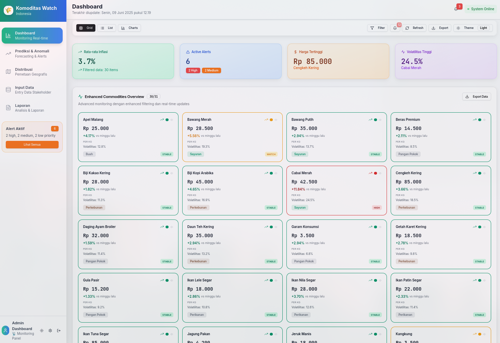

# 📈 Komoditas Watch


## 📝 Description

**Komoditas Watch** is a fullstack application designed to monitor and manage commodity data in real-time. It consists of three main modules:

* **`komoditas-watch-backend`**: A backend service powered by Docker and Prisma ORM.
* **`komoditas-watch-dashboard`**: A frontend web application with an interactive user interface.
* **`komoditas-mi-service`** *(optional)*: A supplementary service module for extended functionalities.

---

## ✅ Prerequisites

Ensure the following software is installed on your system:

* [Node.js](https://nodejs.org/) (latest LTS or supported version)
* npm or yarn
* [Docker](https://www.docker.com/) and Docker Compose
* Git *(optional, for version control)*

---

## 🚀 Installation

### 1. Clone the Repository

```bash
git clone <repository-URL>
cd KOMODITAS.WATCH
```

---

### 2. Backend Setup

```bash
cd komoditas-watch-backend
npm install
docker-compose up --build
```

---

### 3. Frontend Setup

```bash
cd ../komoditas-watch-dashboard
npm install
npm run dev
```

> The frontend will typically be accessible at: [http://localhost:3000](http://localhost:3000)

---

### 4. (Optional) Additional Service Setup

```bash
cd ../komoditas-mi-service
# Follow similar steps as backend: install dependencies and run accordingly
```

---

## ⚙️ Configuration

* Copy `.env.example` (if available) to `.env` in each module directory.
* Configure required environment variables such as:

  * Database connection strings
  * API keys or secrets
* Make sure there are **no port conflicts** between backend and frontend.

---

## 🛠 Development Tips

* Run backend and frontend modules **concurrently** in separate terminal windows.
* Use:

```bash
npm run build
```

in each module (if available) to build production-ready apps before deployment.

---

## 🤝 Contribution

We welcome contributions!

* Submit issues for bugs or feature requests.
* Fork the repo and make a pull request for contributions.

---

## 📄 License

\[Specify license, e.g., MIT License]

---

## 📬 Contact

For questions or collaboration, reach out to: **\[your name]**
📧 Email: **\[[your.email@example.com](mailto:your.email@example.com)]**

---

Jika kamu ingin versi README ini dalam bahasa Indonesia juga, atau ingin saya bantu menambahkan badge GitHub, status CI/CD, atau struktur folder, tinggal bilang saja!
